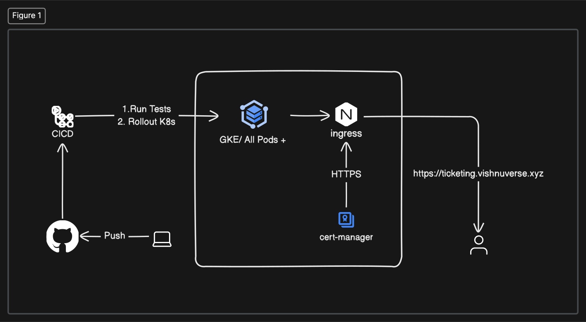

# Ticket Booking Microservices Application

### Overview

This is an application for selling and buying tickets online. It is a microservice application running on NodeJS services and NextJS client, the application is divided into 6 different microservices for client and backend requirements. Each service is responsible for different business operations with mongodb for data storage and containerized using docker and made into isolated pods using k8s. The infrastructure uses NATS streaming service for synchronization of data operations in different pods with respect to other services making the whole architecture robust and decoupled from each other.

### Services

1. auth
   - auth service for authentication of users, with validation and authorization of users.
2. client
   - runs the nextjs client app for the application.
3. expiration
   - listens on events from streaming services for expiring payments after a certain period, to make sure no tickets get locked in and be unsold for a very long time
4. nats
   - message queue for fault tolerant streaming service making sure that data is not redundant within each independent pods
5. orders
   - handles the order creation and displaying of orders.
6. payments
   - handles the payments logic, uses stripe payment API
7. tickets
   - handles the ticket creation and displaying of tickets

### Run the application locally

skaffold for local development

run `skaffold dev`

### Architecture

### Challenges

- Running on a free credit tier the resource utilization may break some pods at times, which requires manual interventions to resolve the issue
- Whenever there is an application crashing there is no single point of logs to be reported for debugging the issue
- The TLS/HTTPS Certificate is generated manually, which means overall the application lacks automation of trivial tasks

## Future Scopes

- IaC: the infrastructure is provisioned manually, resulting in overheads and downtimes.
- Automation & Overall lack of if: we are manually setting up infra to even generating the HTTPS certificates, this means we have to wait until all dependencies have been settled.
